# Plano de Experimento – Scoping e Planejamento

## 1. Identificação básica

### 1.1 Título do experimento
Avaliação de um Software com Interface Gráfica para Mineração Automatizada de Repositórios GitHub e Análise de Métricas de Pull Requests utilizando Paralelismo e Checkpoints

### 1.2 ID / código
EXP-GH-METRICS-2025-01

### 1.3 Versão do documento e histórico de revisão
| Versão | Data       | Descrição                             |
|--------|------------|----------------------------------------|
| v1.0   | 2025-11-21 | Criação inicial do plano de experimento |

### 1.4 Datas (criação, última atualização)
- **Criação:** 21/11/2025  
- **Última atualização:** 21/11/2025  

### 1.5 Autores
- **Lucas Randazzo** – Engenharia de Software – lucasrandazzo2@gmail.com

### 1.6 Responsável principal (PI)
**Lucas Randazzo**

### 1.7 Projeto / iniciativa relacionada
Este experimento faz parte da proposta de desenvolvimento de um **software instalável com interface gráfica**, cujo objetivo é facilitar a mineração de repositórios GitHub e o cálculo de métricas de Pull Requests para fins de análise empírica em Engenharia de Software.

---

## 2. Contexto e problema

### 2.1 Descrição do problema / oportunidade
Pull Requests (PRs) são elementos centrais no processo de revisão de código em projetos GitHub, influenciando diretamente qualidade, colaboração e eficiência no desenvolvimento de software. No entanto, minerar PRs em larga escala para fins de pesquisa apresenta várias dificuldades:

- APIs do GitHub exigem conhecimentos técnicos avançados;
- a coleta manual é lenta e propensa a erros;
- processos longos podem ser interrompidos e precisariam ser retomados;
- pesquisadores iniciantes enfrentam barreiras para extrair e analisar métricas de PRs.

Assim, surge a oportunidade de desenvolver um **software com interface gráfica**, capaz de:

- automatizar a mineração de repositórios;
- extrair, filtrar e consolidar métricas de PRs;
- oferecer melhor observabilidade (progresso, logs, status);
- permitir retomada segura via checkpoints;
- reduzir barreiras para uso por pesquisadores e profissionais.

O problema central é:

> **Como avaliar se um software com interface gráfica melhora a acessibilidade, eficiência e confiabilidade na mineração de repositórios GitHub, mantendo a qualidade das métricas coletadas?**

---

### 2.2 Contexto organizacional e técnico
O experimento será realizado em contexto acadêmico, no âmbito de um curso de Engenharia de Software. O software a ser avaliado está em fase de concepção e deverá integrar:

- uma interface gráfica amigável ao usuário;
- um pipeline automatizado de consultas à API do GitHub;
- execução paralela para reduzir tempos de coleta;
- mecanismos de checkpoint para retomada confiável de execuções.

O foco não é apenas a implementação, mas **avaliar experimentalmente** se essa abordagem traz benefícios reais frente aos métodos tradicionais de mineração, mais técnicos e pouco acessíveis.

---

### 2.3 Trabalhos e evidências prévias

#### **Evidências internas — Laboratório 03 (Disciplina: Laboratório de Experimentação de Software)**  
O experimento se apoia no trabalho realizado no **Laboratório 03** da disciplina de *Laboratório de Experimentação de Software*, disponível em:  
🔗 **https://github.com/o-romeroo/lab-experimentacao-03**

Esse laboratório teve como objetivo analisar métricas de Pull Requests em repositórios populares do GitHub, seguindo critérios como:

- PRs com status MERGED ou CLOSED;  
- pelo menos uma revisão humana;  
- tempo mínimo de análise de 1 hora;  
- métricas de tamanho, tempo, descrição e interação.

Foram respondidas questões de pesquisa sobre como tamanho do PR, tempo de análise, interações e descrição influenciam a aceitação do PR ou o número de revisões.  
Esse estudo evidenciou a **importância de métricas de PRs** e **as dificuldades práticas de realizar essa mineração manualmente**, motivando o desenvolvimento de um software automatizado.

---

#### **Evidências externas — literatura acadêmica**

A literatura em Mineração de Repositórios de Software (MSR) e Code Review destaca:

- **Importância dos PRs como artefatos de colaboração e qualidade**  
- **Desafios de mineração manual**  
- **Fatores que influenciam a aceitação de PRs**

Principais referências:

1. **Rahman & Roy (2014)** — *An Insight into the Pull Requests of GitHub*  
   🔗 https://dl.acm.org/doi/10.1145/2597073.2597121  
   Estuda fatores que diferenciam PRs aceitos de rejeitados em dezenas de projetos open source.

2. **Kalliamvakou et al. (2014)** — *The Promises and Perils of Mining GitHub*  
   🔗 https://chisel.cs.uvic.ca/pubs/kalliamvakou-MSR2014.pdf  
   Discute limitações dos dados da plataforma e riscos ao minerar GitHub sem critérios rigorosos.

3. **Yang et al. (2024)** — *A Survey on Modern Code Review: Progresses, Challenges and Opportunities*  
   🔗 https://github.com/watreyoung/MCR-Survey  
   Apresenta o estado da arte em revisão de código moderna.

4. **Vidoni (2022)** — *A systematic process for Mining Software Repositories*  
   🔗 https://www.sciencedirect.com/science/article/pii/S0950584921002317  
   SLR sobre técnicas e desafios da mineração de repositórios.

5. **Wessel et al. (2023)** — *GitHub Actions: The Impact on the Pull Request Process*  
   🔗 https://www.ime.usp.br/~gerosa/papers/Wessel_EMSE_Actions.pdf  
   Investiga como automações afetam PRs.

Essas evidências reforçam a relevância científica do tema e a necessidade de ferramentas de mineração mais acessíveis e automatizadas.

---

### 2.4 Referencial teórico e empírico essencial

O experimento fundamenta-se em quatro eixos:

#### **(1) Mineração de Repositórios de Software (MSR)**  
Base teórica para extrair e analisar artefatos como PRs.  
Referência:  
🔗 Kalliamvakou et al. (2014) – https://chisel.cs.uvic.ca/pubs/kalliamvakou-MSR2014.pdf

#### **(2) Métricas de Pull Requests**  
Métricas como tamanho, interação e tempo de análise são amplamente utilizadas na literatura para caracterizar processos de revisão.  
Referência:  
🔗 Rahman & Roy (2014) – https://dl.acm.org/doi/10.1145/2597073.2597121

#### **(3) Paralelismo e Tolerância a Falhas**  
Conceitos herdados de sistemas distribuídos orientam o uso de paralelismo e checkpoints para lidar com execuções longas.

#### **(4) Interfaces gráficas e usabilidade**  
GUI melhora observabilidade e acessibilidade em ferramentas técnicas.  
Baseado em princípios clássicos de IHC (Norman, Nielsen).

---

## 3. Objetivos e questões (Goal / Question / Metric)

### 3.1 Objetivo geral (Goal Template)

**Analisar** a eficácia de um software com interface gráfica para mineração automatizada de repositórios GitHub e coleta de métricas de Pull Requests, **com o propósito de** avaliar sua eficiência, confiabilidade, completude e usabilidade, **sob a perspectiva** de pesquisadores e usuários técnicos, **no contexto** de estudos empíricos em Engenharia de Software que demandam extração de dados em larga escala.

### 3.2 Objetivos específicos

- **OE1 – Eficiência:** Avaliar se o software GUI melhora o desempenho da mineração em termos de tempo total, throughput e paralelismo.
- **OE2 – Confiabilidade:** Avaliar a resiliência do processo, especialmente quanto à recuperação via checkpoints e redução de falhas.
- **OE3 – Completude:** Avaliar se as métricas de PRs coletadas pela ferramenta são completas e consistentes em relação ao baseline tradicional.
- **OE4 – Usabilidade:** Avaliar a acessibilidade e facilidade de uso do software para usuários com níveis variados de experiência.

### 3.3 Questões de pesquisa

#### **Para OE1 – Eficiência**
- **Q1.1:** O software reduz o tempo total de mineração?
- **Q1.2:** O software aumenta o throughput (PRs/min, repos/hora)?
- **Q1.3:** O uso de paralelismo no software melhora o desempenho?

#### **Para OE2 – Confiabilidade**
- **Q2.1:** O software apresenta menos falhas que o método tradicional?
- **Q2.2:** Os checkpoints permitem retomada eficaz após interrupções?
- **Q2.3:** O sistema registra e sinaliza erros de forma adequada?

#### **Para OE3 – Completude**
- **Q3.1:** O software coleta a mesma quantidade de PRs que o método baseline?
- **Q3.2:** As métricas de PR são equivalentes entre métodos?
- **Q3.3:** Há perda de dados causada pelo paralelismo?

#### **Para OE4 – Usabilidade**
- **Q4.1:** Os usuários conseguem completar tarefas sem dificuldade?
- **Q4.2:** A interface gráfica é percebida como intuitiva?
- **Q4.3:** Os usuários preferem a GUI ao método tradicional?

### 3.4 Métricas associadas (GQM)

#### **Tabela GQM**

| Objetivo | Pergunta | Métricas associadas |
|----------|----------|----------------------|
| OE1 | Q1.1 | M1 – Tempo total de execução; M2 – Tempo médio por repositório |
| OE1 | Q1.2 | M3 – PRs/min; M4 – Repositórios/hora |
| OE1 | Q1.3 | M5 – Tempo médio por thread; M6 – Speedup |
| OE2 | Q2.1 | M7 – Taxa de falhas; M8 – Interrupções não tratadas |
| OE2 | Q2.2 | M9 – Progresso recuperado; M10 – Tempo de retomada |
| OE2 | Q2.3 | M11 – Eventos de erro registrados; M12 – Tempo de detecção |
| OE3 | Q3.1 | M13 – Percentual de PRs coletados; M14 – Diferença absoluta de PRs |
| OE3 | Q3.2 | M15 – Correlação entre métricas; M16 – Diferença média |
| OE3 | Q3.3 | M17 – PRs perdidos por thread; M18 – Métricas incompletas (%) |
| OE4 | Q4.1 | M19 – Tempo para completar tarefa; M20 – Taxa de sucesso |
| OE4 | Q4.2 | M21 – SUS Score; M22 – Erros cometidos pelo usuário |
| OE4 | Q4.3 | M23 – Preferência declarada; M24 – Satisfação geral |

---

### **Tabela abrangente de métricas**

| Código | Nome da métrica | Descrição | Unidade | Fonte dos dados |
|--------|------------------|-----------|----------|------------------|
| M1 | Tempo total de execução | Tempo total do processo de mineração | minutos | logs do sistema |
| M2 | Tempo médio por repositório | Média de tempo gasto em cada repositório | minutos | logs do sistema |
| M3 | PRs por minuto | Throughput da mineração | PR/min | contagem de PRs |
| M4 | Repositórios por hora | Fluxo de processamento | repos/hora | logs do sistema |
| M5 | Tempo médio por thread | Tempo médio de execução paralela | minutos | logs de threads |
| M6 | Speedup | Razão entre execução paralela e sequencial | adimensional | comparação experimental |
| M7 | Taxa de falhas | Proporção de execuções com erros | % | relatórios de erro |
| M8 | Interrupções não tratadas | Falhas que não foram recuperadas | contagem | logs |
| M9 | Progresso recuperado | Percentual restaurado após retomada | % | checkpoints |
| M10 | Tempo de retomada | Tempo entre falha e retomada | segundos | tempo de execução |
| M11 | Eventos de erro | Número de erros detectados | contagem | logs |
| M12 | Tempo de detecção de falha | Tempo até identificar erro | segundos | logs |
| M13 | Percentual de PRs coletados | % de PRs coletados vs baseline | % | comparação de datasets |
| M14 | Diferença de PRs | Quantidade absoluta coletada a menos ou a mais | contagem | datasets |
| M15 | Correlação entre métricas | Correlação Pearson/Spearman entre métodos | coeficiente | cálculo estatístico |
| M16 | Diferença média das métricas | Diferenças absolutas normalizadas | valor médio | estatística |
| M17 | PRs perdidos por thread | PRs descartados por falha de thread | contagem | logs |
| M18 | Métricas incompletas | Percentual de PRs com campos ausentes | % | dataset final |
| M19 | Tempo para completar tarefa | Tempo para usuário executar ação | minutos | teste de usabilidade |
| M20 | Taxa de sucesso | % de tarefas concluídas sem erro | % | sessão de testes |
| M21 | SUS Score | Nota do System Usability Scale | pontos (0–100) | questionário SUS |
| M22 | Erros do usuário | Quantidade de erros cometidos | contagem | observação |
| M23 | Preferência declarada | % de usuários que preferem a GUI | % | questionário |
| M24 | Satisfação geral | Avaliação do usuário | Likert (1–5) | questionário |

---

## 4. Escopo e contexto do experimento

### 4.1 Escopo funcional / de processo

**Incluído:**
- execução do software GUI para mineração de PRs;
- comparação com baseline baseado em scripts;
- coleta de métricas de eficiência, confiabilidade e completude;
- aplicação de testes de usabilidade.

**Excluído:**
- análise qualitativa do conteúdo dos PRs;
- uso de APIs privadas ou datasets externos;
- avaliação do código interno do software.

### 4.2 Contexto do estudo

O estudo ocorrerá em ambiente acadêmico, no contexto de um projeto de Engenharia de Software. Os participantes incluem estudantes e pesquisadores com familiaridade intermediária com GitHub. O projeto analisado não é crítico, mas envolve manipulação de grande volume de dados e execução prolongada.

### 4.3 Premissas

- A API do GitHub estará funcional durante o experimento.  
- O ambiente terá conexão estável.  
- Os participantes terão conhecimento básico sobre PRs.  
- O software GUI estará funcional e estável para testes.

### 4.4 Restrições

- Tempo limitado de execução em laboratório;  
- Disponibilidade limitada de tokens da API GitHub;  
- Equipamentos com desempenho heterogêneo;  
- Amostra pequena de usuários para testes.

### 4.5 Limitações previstas

- Resultados podem não generalizar para ambientes industriais;  
- A variabilidade de comportamento da API pode afetar a medição;  
- Perfil limitado dos participantes reduz validade externa.

---

## 5. Stakeholders e impacto esperado

### 5.1 Stakeholders principais

- Pesquisadores  
- Estudantes  
- Professores/orientadores  
- Desenvolvedores  
- Comunidade MSR  

### 5.2 Interesses e expectativas

| Stakeholder | Expectativas |
|-------------|--------------|
| Pesquisadores | Maior produtividade, datasets consistentes |
| Estudantes | Ferramenta fácil de usar |
| Professores | Estudos reprodutíveis |
| Desenvolvedores | Análises internas de code review |
| Comunidade MSR | Metodologia replicável |

### 5.3 Impactos potenciais

- Redução de tempo de mineração;  
- Aumento da confiabilidade da coleta;  
- Facilitação de estudos empíricos;  
- Possível modificação do processo tradicional de coleta de dados.  

---

## 6. Riscos de alto nível, premissas e critérios de sucesso

### 6.1 Riscos de alto nível

- Falhas de rede ou API do GitHub;  
- Dados incompletos por limitações de request;  
- Baixa aceitação da GUI pelos usuários;  
- Falhas críticas sem recuperação via checkpoint.

### 6.2 Critérios de sucesso globais

- Coleta de ≥ 95% dos PRs do baseline;  
- Tempo de execução ≤ baseline;  
- SUS ≥ 70;  
- Taxa de falhas reduzida ou mitigada.

### 6.3 Critérios de parada antecipada

- Indisponibilidade da API GitHub;  
- Falha crítica no software GUI;  
- Ambiente inadequado para execução;  
- Mudança de escopo institucional.

---

## 7. Modelo conceitual e hipóteses

### 7.1 Modelo conceitual do experimento

O experimento baseia-se na premissa de que a **forma de execução do processo de mineração de Pull Requests (GUI vs Script)** atua como um fator que **modifica o comportamento do sistema de coleta de dados** em três dimensões principais:

1. **Eficiência**
   - Tempo total de execução
   - Throughput (PRs/min, repositórios/hora)
   - Speedup obtido pelo paralelismo da GUI

2. **Confiabilidade**
   - Ocorrência de falhas
   - Capacidade de retomada via checkpoints
   - Estabilidade da execução

3. **Completude**
   - Quantidade de PRs coletados
   - Integridade das métricas de PR
   - Consistência entre execuções

Essas dimensões, influenciadas pelo fator “Forma de Execução”, refletem-se diretamente nas **métricas produzidas no dataset final**, permitindo avaliar rigorosamente o impacto entre os dois métodos.

---

### 7.2 Hipóteses formais (H0, H1)

#### Eficiência
- **H0-E1:** Não há diferença significativa no tempo total de mineração entre GUI e Script.  
- **H1-E1:** A GUI reduz o tempo total de mineração.

- **H0-E2:** O throughput não difere entre os métodos.  
- **H1-E2:** A GUI aumenta o throughput.

#### Confiabilidade
- **H0-C1:** A taxa de falhas é equivalente entre GUI e Script.  
- **H1-C1:** A GUI apresenta menor taxa de falhas.

- **H0-C2:** O uso de checkpoints não melhora a retomada.  
- **H1-C2:** A GUI possibilita retomada mais eficaz.

#### Completude
- **H0-K1:** A quantidade de PRs coletados é igual nos dois métodos.  
- **H1-K1:** Há diferença significativa na quantidade de PRs coletados.

- **H0-K2:** As métricas coletadas são equivalentes entre os métodos.  
- **H1-K2:** As métricas coletadas diferem significativamente.

---

### 7.3 Nível de significância e considerações de poder

- **Nível de significância**: α = 0,05  
- **Poder estatístico esperado**: ≥ 0,80  

A grande quantidade de PRs e repositórios envolvidos tende a fornecer tamanho amostral adequado para detecção de diferenças reais entre os tratamentos.

---

## 8. Variáveis, fatores, tratamentos e objetos de estudo

### 8.1 Objetos de estudo
- Repositórios GitHub selecionados.
- Conjuntos de Pull Requests válidos.
- Execuções completas dos processos de coleta via GUI e via Script.

---

### 8.2 Sujeitos / participantes (visão geral)
- Pesquisadores, estudantes ou usuários técnicos.
- Responsáveis apenas por acionar os métodos e registrar resultados.

---

### 8.3 Variáveis independentes (fatores) e seus níveis

| Tipo | Nome | Descrição | Níveis |
|------|------|------------|--------|
| Fator principal | Forma de execução | Método utilizado para minerar PRs | GUI, Script |

---

### 8.4 Tratamentos (condições experimentais)

| Tratamento | Descrição |
|------------|-----------|
| T1 — GUI | Execução completa utilizando o software com interface gráfica |
| T2 — Script | Execução completa utilizando scripts tradicionais em linha de comando |

---

### 8.5 Variáveis dependentes (respostas)

| Variável | Descrição |
|----------|-----------|
| Tempo total | Tempo total de mineração |
| Throughput | PRs por minuto / repositórios por hora |
| Speedup | Ganho relativo obtido com paralelismo |
| Taxa de falhas | Proporção de execuções com erros |
| PRs coletados | Quantidade total de PRs coletados |
| Qualidade das métricas | Completude e consistência dos dados |

---

### 8.6 Variáveis de controle / bloqueio

| Variável | Como será controlada |
|----------|-----------------------|
| Lista de repositórios | Mesma lista em ambos os métodos |
| Ambiente | Mesma máquina e conexão |
| Tokens da API | Mesma distribuição e quantidade |
| Período | Execuções realizadas no mesmo intervalo |

---

### 8.7 Variáveis de confusão conhecidas

| Possível confusor | Estratégia de mitigação |
|-------------------|--------------------------|
| Instabilidade da API do GitHub | Monitoramento e repetição controlada |
| Oscilações de rede | Ambiente fixo e monitorado |
| Comportamento de threads | Execuções replicadas e logs detalhados |

---

### Tabela geral de variáveis

| Tipo | Nome | Descrição |
|------|------|------------|
| Independente | Forma de execução | GUI vs Script |
| Dependente | Tempo total | Medida de eficiência |
| Dependente | Throughput | Fluxo de processamento |
| Dependente | Speedup | Ganho obtido em paralelismo |
| Dependente | Taxa de falhas | Confiabilidade |
| Dependente | PRs coletados | Completude |
| Dependente | Diferença das métricas | Qualidade dos dados |
| Controle | Repositórios | Lista fixa |
| Controle | Ambiente | Hardware/software idênticos |
| Confusão | API GitHub | Variável externa |

---

### Tabela de fatores, tratamentos e combinações

Como o experimento possui apenas um fator binário, as combinações são simples:

| Fator | Níveis | Combinação |
|-------|--------|------------|
| Forma de execução | GUI | GUI |
| Forma de execução | Script | Script |

---

## 9. Desenho experimental

### 9.1 Tipo de desenho
Desenho **completamente randomizado**, com dois tratamentos (GUI e Script).  
Adequado porque:

- Repositórios são independentes.
- Execução automática evita efeitos de aprendizagem.
- Simplicidade e robustez em comparações diretas.

---

### 9.2 Randomização e alocação
- Repositórios serão distribuídos aleatoriamente entre os dois tratamentos.
- A ordem das execuções também será randomizada.
- Será utilizada uma semente fixa (**seed = 42**) para manter reprodutibilidade.

---

### 9.3 Balanceamento e contrabalanço
- A divisão será balanceada (mesmo número aproximado de repositórios por tratamento).
- O contrabalanço pode ser aplicado por meio de inversão da ordem de execução (GUI → Script e Script → GUI), se necessário.
- Como o processo é automatizado, os efeitos de ordem são negligenciáveis.

---

### 9.4 Número de grupos e sessões
- **Grupos:** 2 (GUI e Script)
- **Sessões:** Cada grupo executará o processo completo uma vez, com possibilidade de repetição para reforçar análise estatística.

---

## 10. População, sujeitos e amostragem

### 10.1 População-alvo
A população-alvo consiste em usuários técnicos que realizam mineração de dados em repositórios GitHub, incluindo:
- Pesquisadores de Engenharia de Software
- Estudantes com experiência em Git e GitHub
- Profissionais que utilizam análises de PRs para pesquisa ou desenvolvimento

---

### 10.2 Critérios de inclusão de sujeitos
- Conhecimento básico/intermediário de Git e GitHub  
- Capacidade de executar scripts e/ou ferramentas GUI  
- Disponibilidade para participar de todas as etapas  
- Capacidade de interpretação básica de métricas  

---

### 10.3 Critérios de exclusão de sujeitos
- Nunca ter utilizado GitHub  
- Inabilidade para operar scripts ou GUI  
- Impossibilidade de realizar todas as sessões  
- Conflitos diretos com o desenvolvimento da ferramenta  

---

### 10.4 Tamanho da amostra planejado (por grupo)
- 6 a 10 participantes  
- Divididos igualmente entre GUI e Script  
- O tamanho amostral humano é pequeno, mas os objetos (PRs e repositórios) garantem volume estatístico adequado.

---

### 10.5 Método de seleção / recrutamento
- Amostragem por conveniência  
- Convite enviado a estudantes e pesquisadores do laboratório ou da disciplina  
- Confirmação de participação via formulário  

---

### 10.6 Treinamento e preparação dos sujeitos
Os participantes receberão:
- Guia rápido da GUI  
- Guia rápido dos scripts  
- Checklist operacional  
- Roteiro de execução  
- Ambiente configurado com tokens e repositórios  

---

## 11. Instrumentação e protocolo operacional

### 11.1 Instrumentos de coleta

| Instrumento | Função |
|-------------|--------|
| Aplicação GUI | Execução paralela com checkpoints |
| Scripts tradicionais | Baseline de comparação |
| Logs gerados automaticamente | Registro de tempo, falhas, throughput |
| CSV final | Consolidação das métricas dos PRs |
| Questionário SUS | Avaliação de usabilidade |
| Planilha de métricas | Consolidação final dos dados |
| Roteiro operacional | Padronização do procedimento |

---

### 11.2 Materiais de suporte
- Manual do usuário da GUI  
- Manual de execução do script  
- Documento com descrição das métricas  
- Checklist do ambiente  
- Modelo de relatório de execução  

---

### 11.3 Procedimento experimental (protocolo – passo a passo)

O processo segue as etapas:

1. Preparar o ambiente  
2. Configurar tokens, instalar GUI e scripts  
3. Distribuir lista fixa de repositórios  
4. Selecionar e instruir os participantes  
5. Alocar participantes aleatoriamente em GUI ou Script  
6. Realizar execuções completas dos tratamentos  
7. Coletar logs, CSVs e métricas  
8. Aplicar questionário SUS  
9. Consolidar dados  
10. Preparar dataset final para análises estatísticas  

---

### Fluxograma do processo operacional

```mermaid
flowchart TD

    A[Início do Experimento] --> B[Preparação do Ambiente]
    B --> B1[Configurar tokens de API]
    B --> B2[Instalar e validar GUI]
    B --> B3[Disponibilizar scripts tradicionais]
    B --> B4[Distribuir lista fixa de repositórios]

    B4 --> C[Seleção e Preparação dos Participantes]
    C --> C1[Verificar critérios de inclusão]
    C --> C2[Aplicar instruções padronizadas]
    C --> C3[Randomizar participantes nos tratamentos]

    C3 --> D[Execução dos Tratamentos]
    D --> D1[Grupo GUI - Executar mineração com interface gráfica]
    D --> D2[Grupo Script - Executar mineração via linha de comando]

    D1 --> E[Coleta de Dados Operacionais]
    D2 --> E

    E --> E1[Extrair métricas: tempo, throughput, falhas]
    E --> E2[Registrar PRs coletados e completude]
    E --> E3[Salvar logs e resultados CSV]

    E3 --> F[Avaliação Pós-Execução]
    F --> F1[Aplicar Questionário SUS]
    F --> F2[Coletar feedback qualitativo]

    F --> G[Consolidação dos Dados]
    G --> G1[Unificar CSVs]
    G --> G2[Gerar dataset final padronizado]

    G2 --> H[Fim - Pronto para Análise Estatística]
```

---
    
### 11.4 Plano de piloto

O piloto terá as seguintes características:

- Execução piloto com **2 participantes**
- Uso de **4 repositórios** para validar o fluxo completo

Ajustes serão realizados caso ocorram:

- Falhas operacionais
- Inconsistências nas métricas geradas
- Dificuldades relatadas pelos participantes
- Logs insuficientes para análise estatística

---

## 12. Plano de análise de dados (pré-execução)

### 12.1 Estratégia geral de análise

A análise seguirá as etapas:

1. Consolidar o dataset final (GUI vs Script)
2. Aplicar testes de normalidade
3. Comparar métricas de:
   - Eficiência
   - Confiabilidade
   - Completude
4. Avaliar significância estatística entre os métodos
5. Avaliar usabilidade via SUS
6. Relacionar resultados com hipóteses H0/H1
7. Gerar conclusões sobre o impacto da ferramenta

---

### 12.2 Métodos estatísticos planejados

- **Shapiro-Wilk** — testar normalidade dos dados  
- **t-test** — se houver normalidade  
- **Mann–Whitney U** — se não houver normalidade  
- **Correlação de Spearman** — avaliar associação entre métricas contínuas  
- **Teste Qui-quadrado** — comparar proporções de falhas  
- **Intervalos de Confiança (95%)** — medir precisão das diferenças  
- **Cálculo do SUS Score** — medir usabilidade da GUI  

---

### 12.3 Tratamento de dados faltantes e outliers

**Dados faltantes:**
- Exclusão quando < 5%  
- Imputação simples, se necessário  

**Outliers:**
- Avaliação por:
  - **IQR** (Interquartile Range)
  - **Contexto experimental** (ex.: falha de rede ou API)
- Outliers operacionais serão documentados e não removidos sem justificativa formal

---

### 12.4 Plano de análise para dados qualitativos

Os dados qualitativos (comentários e impressões dos participantes) serão analisados por:

- **Análise de conteúdo**
- **Categorização temática**, incluindo:
  - Intuitividade
  - Dificuldades
  - Percepção geral da ferramenta
- **Triangulação** com SUS Score
- Busca por diferenças qualitativas entre GUI e Script

---

## 13. Avaliação de validade (ameaças e mitigação)

### 13.1 Validade de conclusão
Liste ameaças que podem comprometer a robustez das conclusões estatísticas (baixo poder, violação de suposições, erros de medida) e como pretende mitigá-las.

### 13.2 Validade interna
Identifique ameaças relacionadas a causas alternativas para os efeitos observados (history, maturation, selection, etc.) e explique suas estratégias de controle.

### 13.3 Validade de constructo
Refleta se as medidas escolhidas realmente representam os conceitos de interesse e descreva como você reduzirá ambiguidades de interpretação.

### 13.4 Validade externa
Discuta em que contextos os resultados podem ser generalizados e quais diferenças de cenário podem limitar essa generalização.

### 13.5 Resumo das principais ameaças e estratégias de mitigação
Faça uma síntese das ameaças mais críticas e das ações planejadas, de preferência em forma de lista ou tabela simples.

---

## 14. Ética, privacidade e conformidade

### 14.1 Questões éticas (uso de sujeitos, incentivos, etc.)
Descreva potenciais questões éticas (pressão para participar, uso de estudantes, incentivos, riscos de exposição) e como serão tratadas.

### 14.2 Consentimento informado
Explique como os participantes serão informados sobre objetivos, riscos, benefícios e como registrarão seu consentimento.

### 14.3 Privacidade e proteção de dados
Indique que dados pessoais serão coletados, como serão protegidos (anonimização, pseudoanonimização, controle de acesso) e por quanto tempo serão mantidos.

### 14.4 Aprovações necessárias (comitê de ética, jurídico, DPO, etc.)
Liste órgãos ou pessoas que precisam aprovar o experimento (comitê de ética, jurídico, DPO, gestores) e o status atual dessas aprovações.

---

## 15. Recursos, infraestrutura e orçamento

### 15.1 Recursos humanos e papéis
Identifique os membros da equipe do experimento e descreva brevemente o papel e responsabilidade de cada um.

### 15.2 Infraestrutura técnica necessária
Liste ambientes, servidores, ferramentas, repositórios e integrações que devem estar disponíveis para executar o experimento.

### 15.3 Materiais e insumos
Relacione materiais físicos ou digitais necessários (máquinas, licenças, formulários, dispositivos) que precisam estar prontos antes da operação.

### 15.4 Orçamento e custos estimados
Faça uma estimativa dos principais custos envolvidos (horas de pessoas, serviços, licenças, infraestrutura) e a fonte de financiamento.

---

## 16. Cronograma, marcos e riscos operacionais

### 16.1 Macrocronograma (até o início da execução)
Defina as principais datas e marcos (conclusão do plano, piloto, revisão, início da operação) com uma visão de tempo realista.

### 16.2 Dependências entre atividades
Indique quais atividades dependem de outras para começar (por exemplo, treinamento após aprovação ética), deixando essas dependências claras.

### 16.3 Riscos operacionais e plano de contingência
Liste riscos ligados a cronograma, disponibilidade de pessoas ou recursos, e descreva ações de contingência caso esses riscos se materializem.

---

## 17. Governança do experimento

### 17.1 Papéis e responsabilidades formais
Defina quem decide, quem executa, quem revisa e quem apenas deve ser informado, deixando claro o fluxo de responsabilidade.

### 17.2 Ritos de acompanhamento pré-execução
Descreva as reuniões, checkpoints e revisões previstos antes da execução, incluindo frequência e participantes.

### 17.3 Processo de controle de mudanças no plano
Explique como mudanças no desenho ou no escopo do experimento serão propostas, analisadas, aprovadas e registradas.

---

## 18. Plano de documentação e reprodutibilidade

### 18.1 Repositórios e convenções de nomeação
Indique onde o plano, instrumentos, scripts e dados (futuros) serão armazenados e quais convenções de nomes serão usadas.

### 18.2 Templates e artefatos padrão
Liste os modelos (questionários, formulários, checklists, scripts) que serão usados e onde podem ser encontrados.

### 18.3 Plano de empacotamento para replicação futura
Descreva o que será organizado desde já (documentos, scripts, instruções) para facilitar a replicação do experimento por outras equipes ou no futuro.

---

## 19. Plano de comunicação

### 19.1 Públicos e mensagens-chave pré-execução
Liste os grupos que precisam ser comunicados e quais mensagens principais devem receber (objetivos, escopo, datas, impactos esperados).

### 19.2 Canais e frequência de comunicação
Defina por quais canais (e-mail, reuniões, Slack/Teams, etc.) e com que frequência as comunicações serão feitas.

### 19.3 Pontos de comunicação obrigatórios
Especifique os eventos que exigem comunicação formal (aprovação do plano, mudanças relevantes, adiamentos, cancelamentos).

---

## 20. Critérios de prontidão para execução (Definition of Ready)

### 20.1 Checklist de prontidão (itens que devem estar completos)
Liste os itens que precisam estar finalizados e aprovados (plano, instrumentos, aprovação ética, recursos, comunicação) para autorizar o início da operação.

### 20.2 Aprovações finais para iniciar a operação
Indique quem precisa dar o “ok final” (nomes ou cargos) e como esse aceite será registrado antes da execução começar.

